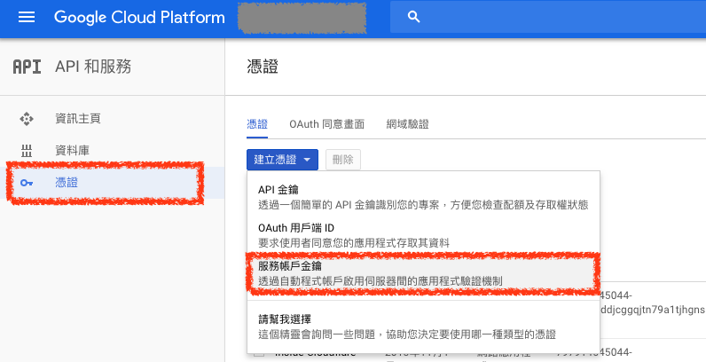
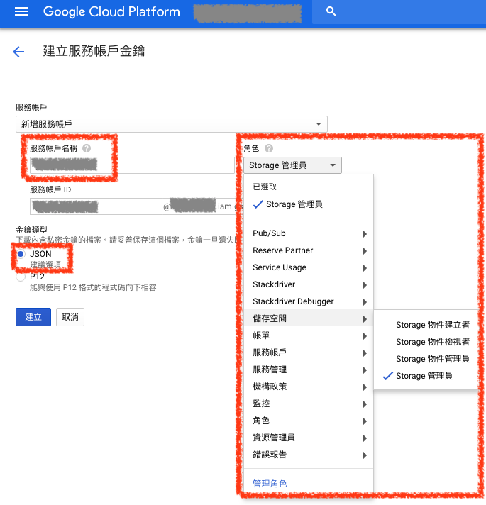

# API 服務

## 1. API 服務憑證

GCP 的 `API 服務憑證` 就像是 AWS 的 `IAM`，設定好權限就可以使用 API 存取 GCP 服務了

### ***A. 建立憑證（Credentials）***

在 `API 服務` 頁面的 `憑證` 頁簽點選 `建立憑證` 按鈕，選擇建立 `服務帳戶金鑰` 即可開始憑證

### ***B. 設定憑證***

在憑證設定頁面，輸入憑證 `帳號名稱`，並選擇服務帳號可以存取的權限 `角色` 是什麼，`金鑰類型` 選擇用 `JSON`

設定完後點選 `建立` 按鈕，下載憑證即可立即使用
