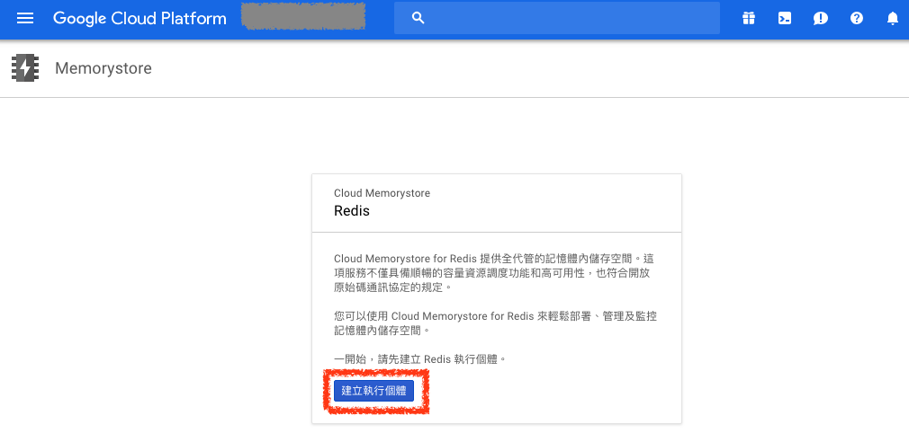
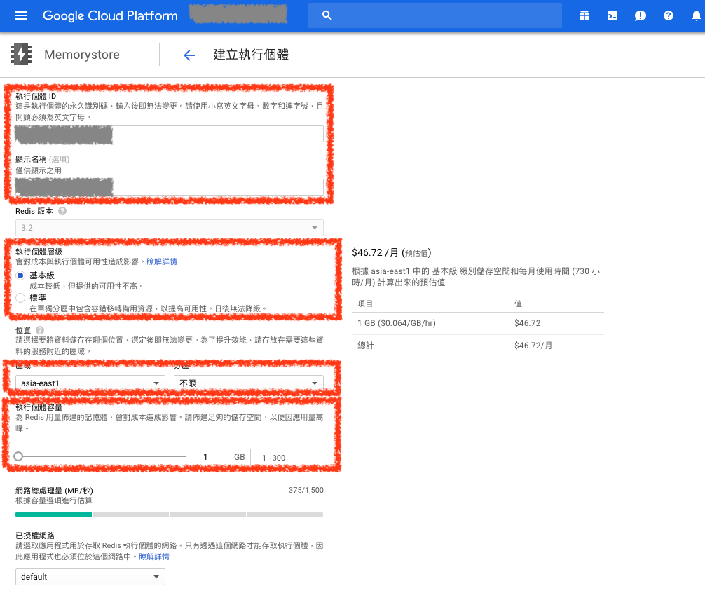
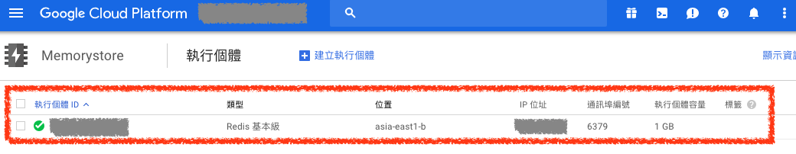

# Google Cloud MemoryStore

GCP 提供 Google Cloud MemoryStore 做 `Redis` 快取機器服務，類似 AWS 的 `ElasticCache`

## 1. 建立 Redis Google Cloud MemoryStore

### ***A. 建立 Redis***

在 `MemoryStore` 頁面點選 `建立執行個體` 按鈕，即可開始建立 Redis 主機

### ***B. 設定 Redis***

輸入 `執行個體 ID` 及 `顯示名稱`，並設定執行個體層級為 `基本級`

選擇 Redis 主機機器放置的區域為 `asia-east1（台灣）`

並設定 Redis 主機的記憶體容量

### ***C. 建立 Redis 完成***

建立完成後就就可以透過它提供的 IP 進行連線摟

## 參考資料
* [Memorystore  |  Google Cloud](https://cloud.google.com/memorystore/)
