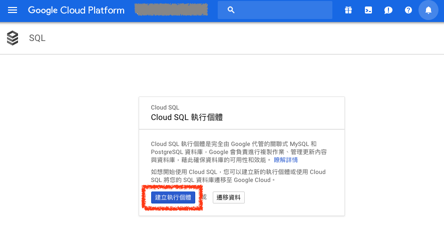
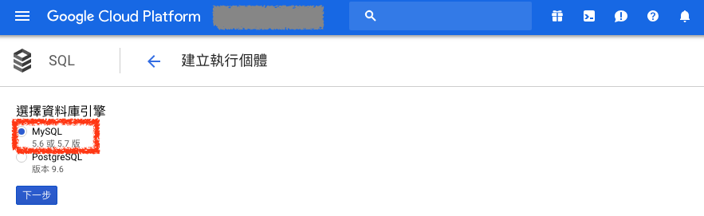
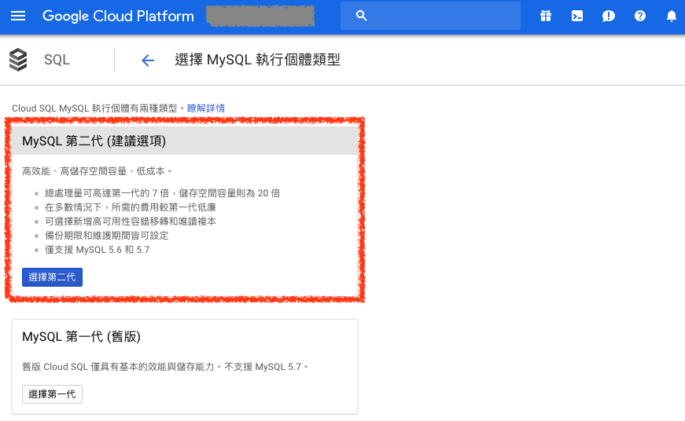
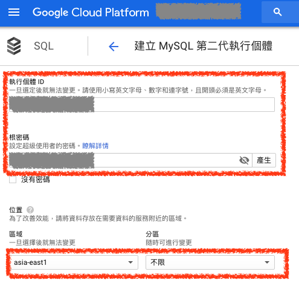
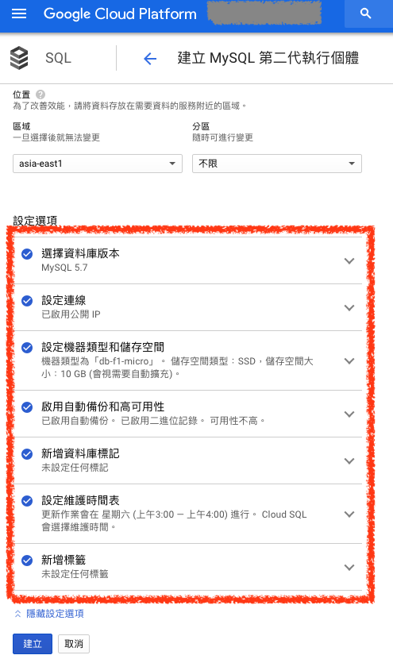
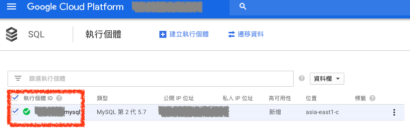
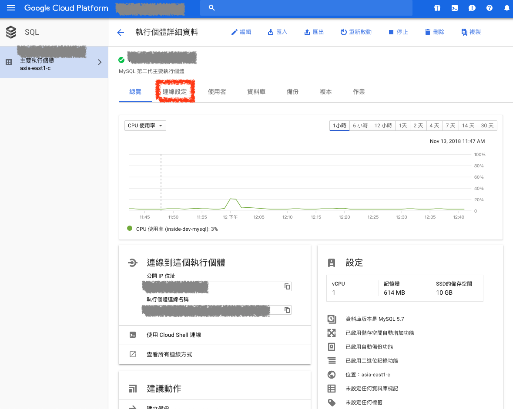
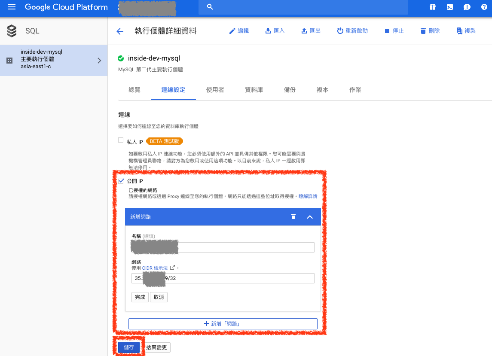

# Google Cloud SQL MySQL

## 1. 建立 MySQL 實例

### ***A. 建立 Cloud SQL 執行個體***

進入到 `Google Cloud SQL` 頁面點選 `建立執行個體` 開始建立 MySQL 實例

### ***B. 選擇 Cloud SQL 引擎***

選擇使用 `MySQL` 當作 Cloud SQL 引擎

### ***C. 選擇 Cloud SQL MySQL 類型***

選擇使用 `MySQL 第二代` 資料庫類型

### ***D. 設定 Cloud SQL MySQL 基本設定***

設定 `Cloud SQL MySQL` 的 `名稱` 及 `root` 帳號的密碼

並選擇區域為 `asia-east1（台灣）`

### ***E. 設定 Cloud SQL MySQL 進階設定***

選擇資料庫版本為 `MySQL 5.7`，設定機器類行為 `db-f1-micro`，儲存空間設定為 `10G` 並 `視需要自動擴充` 儲存空間，設定完成後點選建立即可

### ***F. 完成建立 Cloud SQL MySQL***

建立完成後即可在 `Cloud SQL` 頁面看到剛剛建立的實例

### ***G. Cloud SQL MySQL 實例儀表板***

點選 `Cloud SQL 實例名稱` 即可看到儀表板相關資訊，點選 `連線設定` 可以設定哪些 IP 可以連線到此資料庫

### ***H. Cloud SQL MySQL 實例儀表板***

在連線設定中新增 `Google Compute Engine` 的 IP 即可讓 VM 可以連線到此資料庫

> Cloud SQL 預設禁止任何連線連到資料庫，需要設定 IP 才可允許連線

設定完成後即可連線到 Cloud SQL MySQL 了

## 參考資料
* [\[Day-41\] Google Cloud Platform(3)-建立SQL雲端資料庫 - iT 邦幫忙::一起幫忙解決難題，拯救 IT 人的一天](https://ithelp.ithome.com.tw/articles/10197683)
