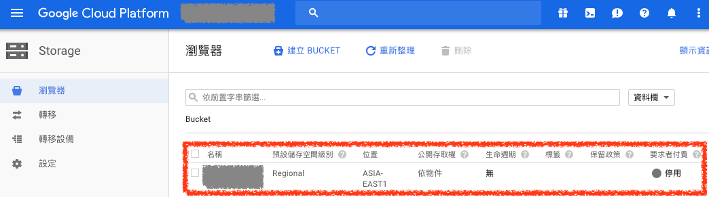

# Google Cloud Storage

GCP 的 `Google Cloud Storage` 就像是 AWS 的 `Simple Storage Service（S3）`

## 1. 建立 bucket

### ***A. 建立 Google Cloud Storage Bucket***

在 `Storage` 的 `瀏覽器` 頁面點選 `建立 Bucket` 按鈕，即可開始建立 Google Cloud Storage Bucket

### ***B. 設定 Google Cloud Storage Bucket***

輸入 Bucket `名稱`，並選擇儲存空間級別，依照自己的需求選擇需要備份的層級，可以先選擇 `Regional` 並選擇 `asia-east1（台灣）`

### ***C. 建立 Google Cloud Storage Bucket 完成***

建立完成後，就可以在頁面上看到剛剛建立的 Bucket 了

## 2. 設定 bucket API 存取憑證

若要使用 `API` 透過 `憑證` 存取 Google Cloud Storage 的資料，可以至 [API 服務](../apis-services/apis-services-README.md) 設定需要的憑證即可

## 參考資料
* [Google Cloud Storage Load Balancer with CDN - YouTube](https://www.youtube.com/watch?v=jZ13GGJW1U4)
