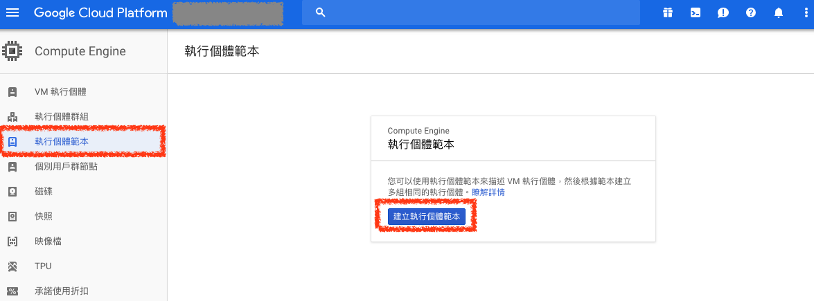
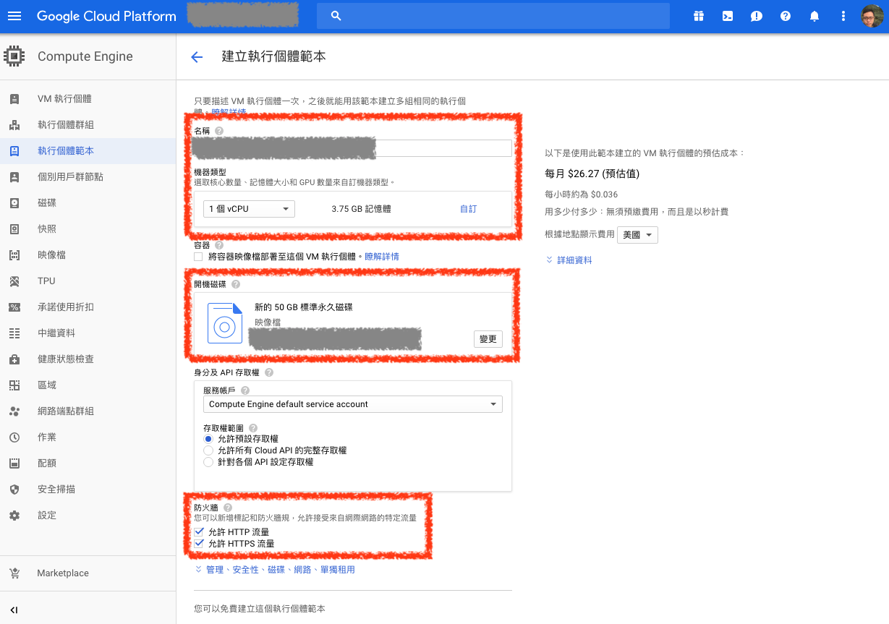
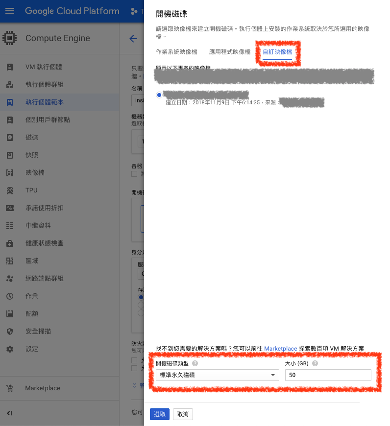
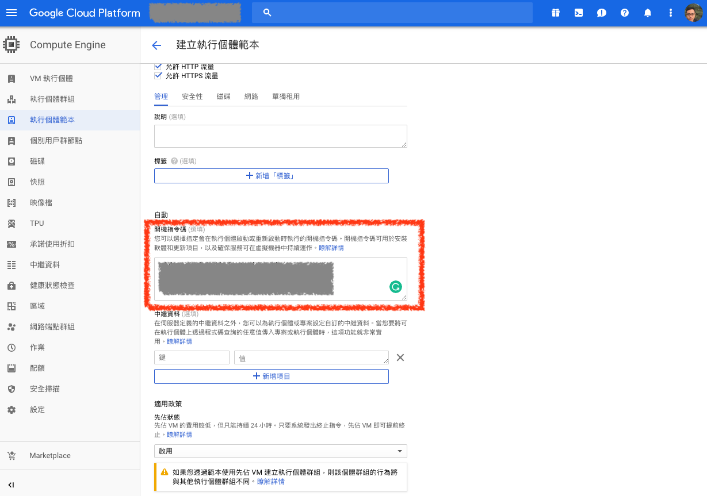
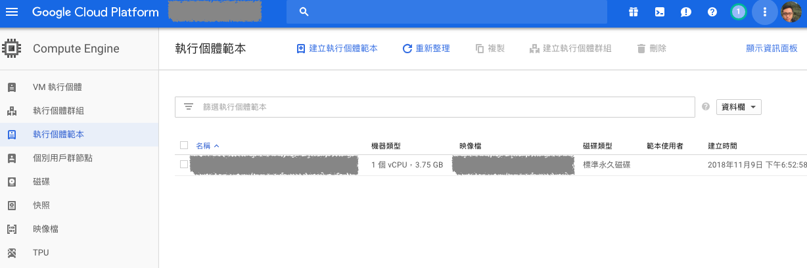
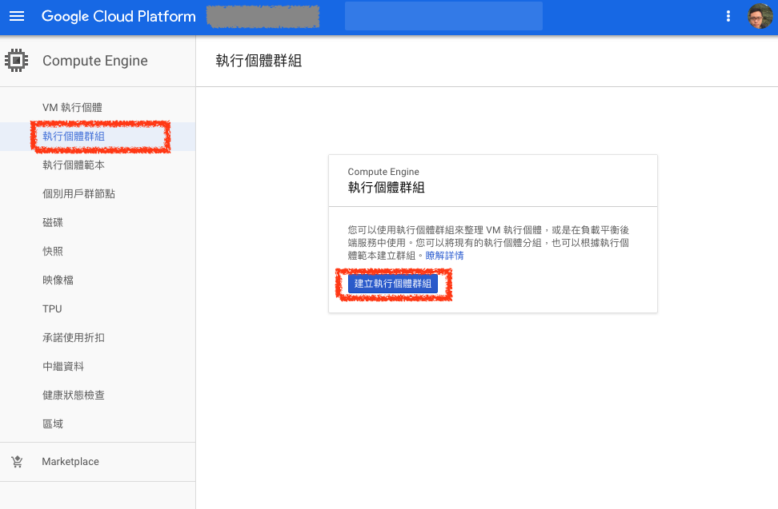
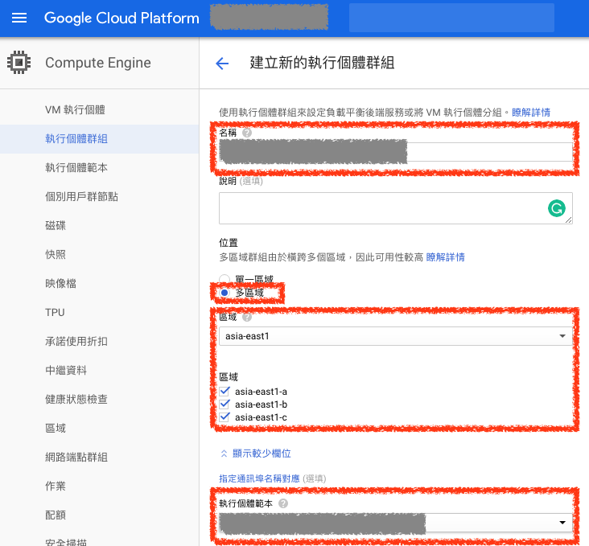
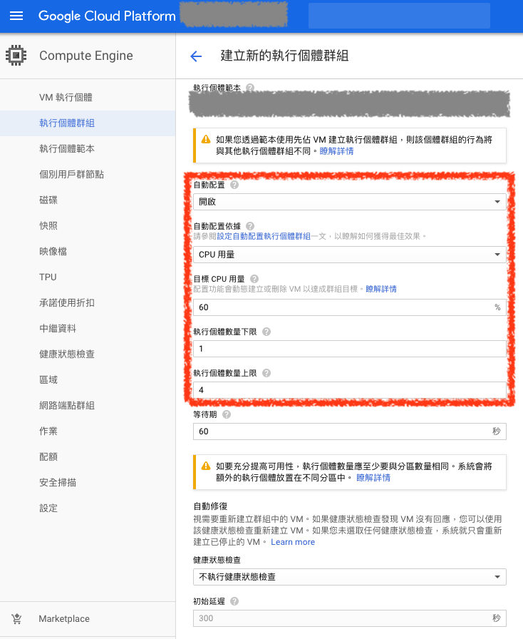
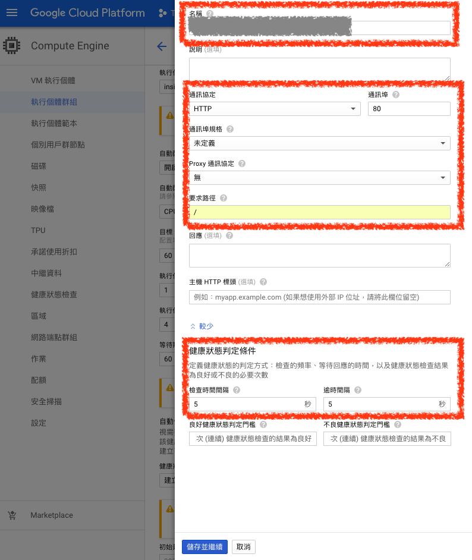
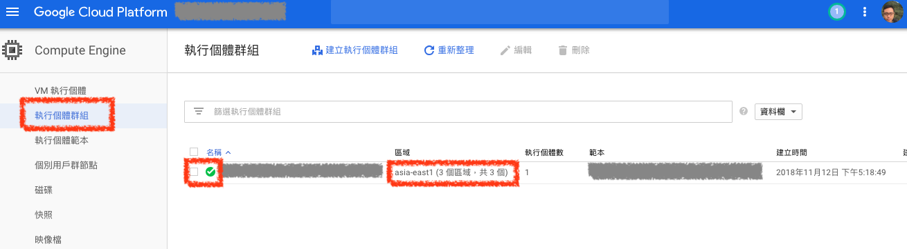

# 自動配置（Auto Scaling）

## 1. 執行個體範本（Instance templates）

GCP 的 `執行個體範本（Instance templates）` 就像是 AWS 的 `Auto Scaling Launch Configurations`，若要執行在 GCP Auto Scaling 必須先設定要執行的機器是哪一種，建立一個可執行的範本

### ***A. 建立執行個體範本（Instance templates）***

在 `執行個體範本` 頁面點選 `建立執行個體範本` 按鈕，即可開始建立 Auto Scaling 需要的 VM 範本

### ***B. 設定執行個體範本***

在設定執行個體範本頁面設定範本 `名稱`，並選擇範本的 `機器類型`

若建立的機器為 web 服務，則可以勾選允許 HTTP 及 HTTPS 流量

### ***C. 設定執行個體範本***

在映像檔案可以選擇自己建立的映像檔案，並設定硬碟大小

### ***D. 設定執行個體範本開機指令碼***

若有需要再開機時需要執行的程式可以在 `開機指令碼` 輸入相關的 shell script

這樣在範本主機建立時就會執行此區塊的程式

### ***E. 完成設定執行個體範本***

在完成設定後就可以看到 `執行個體範本` 已經設定完成

> 範本設定不會被 GCP 收取任何費用

## 2. 執行個體群組（Instance groups）

GCP 的 `執行個體群組（Instance groups）` 就像是 AWS 的 `Auto Scaling Group`，群組會依照 `執行個體範本（Instance templates）` 的設定，自動配置（Auto scaling）機器

### ***A. 建立執行個體群組（Instance groups）***

在 `執行個體群組` 頁面點選 `建立執行個體群組` 按鈕，即可開始建立 Auto Scaling 需要的群組

### ***B. 設定執行個體群組***

輸入執行個體群組 `名稱`，以及這個群組的 VM 是否運行於 `多區域`，區域可以選擇 `asia-east1（台灣）`

在 `執行個體範本` 選擇剛剛建立的執行個體範本即可

### ***C. 設定執行個體群組自動配置（Auto Scaling）***

在 `自動配置（Auto Scaling）` 的部分設定為 `開啟`，並依照 `CPU 用量` 去做擴展的判斷標準，目標是將 CPU 用量維持在 `60` 以下，並設定擴展機器的下限與上限

### ***D. 設定執行個體群組健康狀態檢查（Health Check）***

輸入此健康狀態檢查的 `名稱`

設定固定檢查主機的 `HTTP` 通訊協定，通訊阜為 `80`，檢查請求路徑為根目錄 `/`

設定檢查時間間隔為 `5` 秒，逾時時間間隔為 `5` 秒

### ***E. 建立執行個體群組完成***

設定完後就可以開始建立 `執行個體群組（Instance groups）`，建立完成後就可以看到下列畫面

建立完成後，主機就可以依照設定值，自行進行自動配置（Auto Scaling）了

## 參考資料
* [Google Cloud Load balancer & Autoscaling in ACTION!! (Udemy link below with discount code!) - YouTube](https://www.youtube.com/watch?v=Gn7pGQYkKnA)
