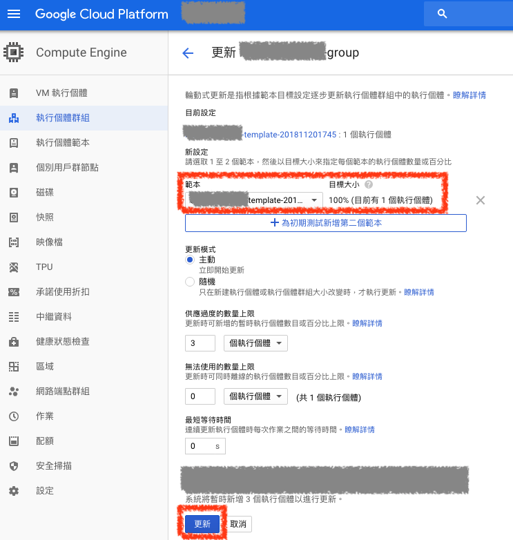

# 輪動式更新（Rolling Update）

`執行個體群組` 是根據 `執行個體範本` 去建立機器的，當我們的範本有異動時，我們也希望在 `執行個體群組` 中的主機是根據新範本去執行的。

若要讓 `執行個體群組` 更新範本主機，而不影響線上服務無痛轉移的話，可以使用 `輪動式更新` 去更新主機版本

### ***A. 輪動式更新按鈕***

當您新的 `執行個體範本` 建立完後，在 `執行個體群組` 頁面上方點選 `輪動式更新` 按鈕

### ***B. 設定輪動式目標範本***

在 `目前設定` 可以看到 ***目前的範本*** 是哪個，然後在下方 `範本` 的位置選擇新的範本，然後點選 `更新` 按鈕

這樣的話 `輪動式更新` 就會立即開一台使用新範本的機器，在新機器開好後，再把舊範本的機器關機，這樣就可以達到更新範本主機，而不影響線上服務無痛轉移
