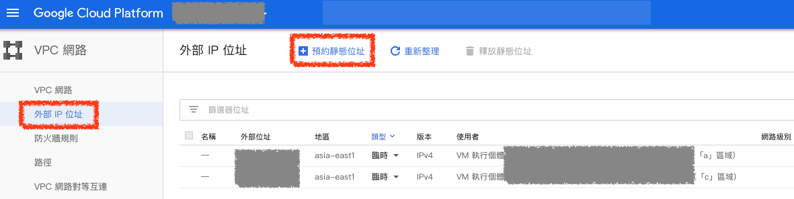
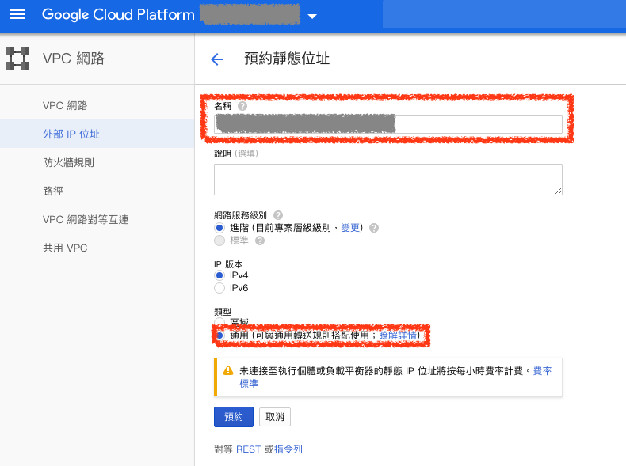
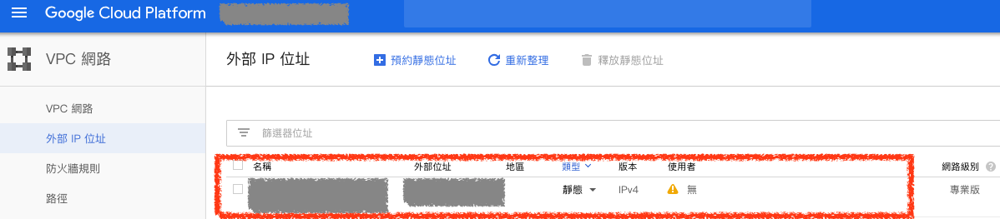

# 負載平衡（Load Balancer）

## 1. VPC 網路

之後的網域會設定連線到此 `負載平衡（Load Balancer）` 的 IP，所以在建立 `負載平衡（Load Balancer）` 前，必須為您的 `負載平衡（Load Balancer）` 申請一個固定的 IP，避免 IP 換掉，導致 DNS 連線不到

### ***A. 預約外部 IP 位址（External IP addresses）***

在 `VPC` 網路選擇 `外部 IP 位址（External IP addresses）` 頁籤，點選 `預約靜態位址（Reserve a static address）`

### ***B. 預約外部 IP 位址設定***

輸入此 IP 位址 `名稱`，在類型部分選擇 `通用`，然後進行預約

### ***B. 預約外部 IP 位址完成***

預約完成後就可以看到預約的 IP 位址資訊了

## 參考資料
* [Google Cloud Load balancer & Autoscaling in ACTION!! (Udemy link below with discount code!) - YouTube](https://www.youtube.com/watch?v=Gn7pGQYkKnA)
