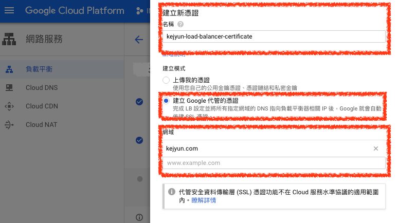

# 負載平衡（Load Balancer）

## 1. VPC 網路

之後的網域會設定連線到此 `負載平衡（Load Balancer）` 的 IP，所以在建立 `負載平衡（Load Balancer）` 前，必須為您的 `負載平衡（Load Balancer）` 申請一個固定的 IP，避免 IP 換掉，導致 DNS 連線不到

### ***A. 預約外部 IP 位址（External IP addresses）***

在 `VPC` 網路選擇 `外部 IP 位址（External IP addresses）` 頁籤，點選 `預約靜態位址（Reserve a static address）`

### ***B. 預約外部 IP 位址設定***

輸入此 IP 位址 `名稱`，在類型部分選擇 `通用`，然後進行預約

### ***C. 預約外部 IP 位址完成***

預約完成後就可以看到預約的 IP 位址資訊了

## 2. 負載平衡（Load Balancer）

### ***A. 建立負載平衡***

在 `網路服務` 的 `負載平衡` 頁面，點選 `建立負載平衡` 按鈕

選擇 `HTTP(S) 負載平衡`

### ***B. 設定負載平衡***

設定負載平衡 `名稱`

### ***C. 設定負載平衡後端服務***

Google Cloud Load Balancer 需要設定他需要將前端收到的請求，轉送到後端的哪個服務，這裡的服務可以是 `Auto Scaling 執行個體群組（Instance groups）` 或是 `Google Cloud Storage Bucket`

> 詳細的 Auto Scaling 執行個體群組建立方式可以看 [這篇](../auto-scaling/auto-scaling-README)

在 `後端設定` 選擇 `建立後端服務`

輸入 `後端服務名稱`，選擇 `HTTPS` 通訊協定，在 `執行個體群組` 選擇需要指向的[執行個體群組](../auto-scaling/auto-scaling-README)，並將 `通訊埠編號` 設定為 `443`

> 若為 `HTTP` 通訊協定則將 `通訊埠編號` 設定為 `80`

建立負載平衡後端服務完成後，就可以看到建立完成的 `後端服務`

### ***D. 設定主機與路徑規則***

在路徑規則可以設定 `指定的網址路徑` 到不同的 `後端服務`，像是 `/assets/images` 到 `A 後端服務`，`/assets/js` 到 `B 後端服務`

如果不用到指定的服務的話，則不用設定

### ***E. 設定負載平衡前端服務***

將剛剛設定的 IP 設為此負載平衡前端服務 `IP 位址`

在 `憑證` 部分點選 `建立新憑證` 按鈕

設定`憑證名稱`，並選擇 `建立 Google 代管的憑證` 選項，輸入您的 `網域` 像是 `kejyun.com`

### ***F. 檢查負載平衡服務設定***

在最後 `檢查並完成` 頁籤可以看到剛剛設定的負載平衡服務設定

這樣就完成負載平衡建立了

完成負載平衡建立後，可以將 DNS 指定到此 `負載平衡 IP`，那麼負載平衡就會自動將所有來的請求流量，根據規則分配到 `後端服務` 了！

## 參考資料
* [Google Cloud Load balancer & Autoscaling in ACTION!! (Udemy link below with discount code!) - YouTube](https://www.youtube.com/watch?v=Gn7pGQYkKnA)
