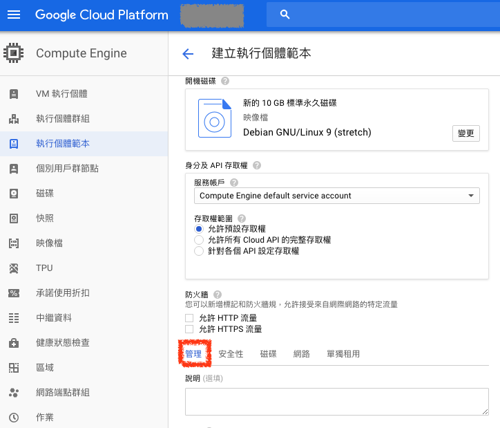
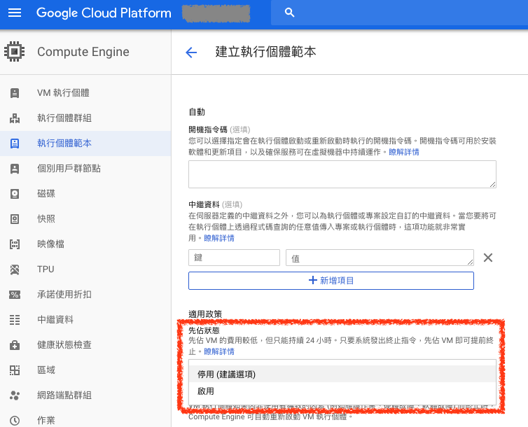

# 先佔 VM 實例（Preemptible VM Instances）

`先佔 VM 實例`（Preemptible VM Instances） 類似於 AWS EC2 的 `Spot Instance`，可以用比較少的花費去建立運算主機，但是這樣的主機只能持續使用 24 小時，24 小時後就會被強制關機

> 先佔 VM 的費用較低，但只能持續 24 小時。只要系統發出終止指令，先佔 VM 即可提前終止。

## 執行個體先佔 VM 實例

在建立執行個體 VM 頁面，點選下方的 `管理頁籤`

在下方的 `先佔狀態` 改為 `啟用` 即可

## 執行個體範本先佔 VM 實例

在建立執行個體範本頁面，點選下方的 `管理頁籤`

在下方的 `先佔狀態` 改為 `啟用` 即可

## 參考資料
* [Preemptible VM Instances  |  Compute Engine Documentation  |  Google Cloud](https://cloud.google.com/compute/docs/instances/preemptible)
* [先佔 VM - 運算執行個體  |  Google Cloud](https://cloud.google.com/preemptible-vms/)
