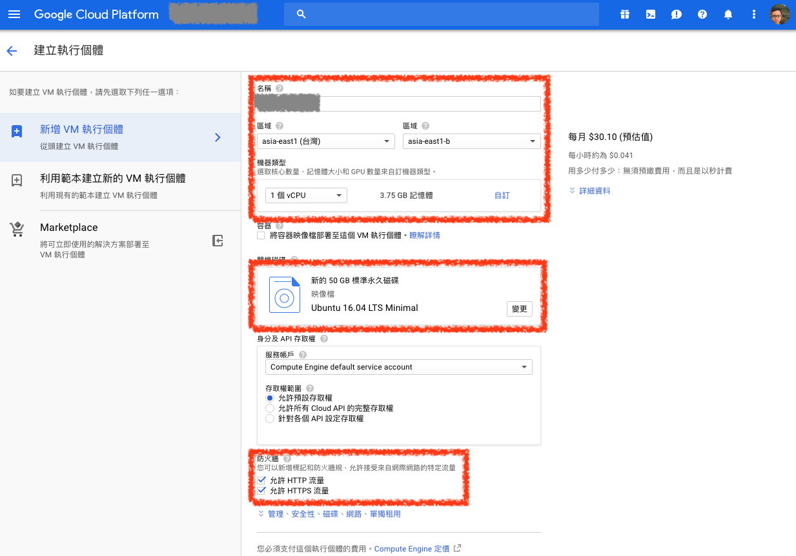

# VM 實例（VM Instances）


## 建立 Google Compute Engine（GCE） VM Instance

### ***1. 開始建立***

進入 `Compute Engine` 選單中，點選 `VM 執行個體`，在 `VM 執行個體` 頁面點選 `建立` 按鈕，即可開始建立 VM


### ***2. 設定 VM 設定***

輸入這次建立 VM 的 `名稱`，選擇主機所在 `區域`，並選擇要建立的[機器類型](https://cloud.google.com/compute/docs/machine-types)是什麼

若要做為 web 服務，則需要在 `防火牆` 設定選擇允許 HTTP 及 HTTPS 流量



### ***3. 選擇開機磁碟設定***

在 `開機磁碟` 選擇要使用的映像檔，這裡選擇的是 GCP 官方提供的 `Ubuntu 16.04 LTS Minimal`

並將硬碟設為 `標準永久磁碟`，容量為 `50 G`


### ***4. 建立完成***

建立完成後，在 `VM 執行個體` 頁面即可看到剛剛建立的 VM 主機了


## 連線至 VM 主機


```shell
gcloud compute --project "<project-name>" ssh --zone <backend-zone> <backend-name>
```

```shell
gcloud compute --project "kejyun-research" ssh --zone asia-east1-b kejyun-dev
```


## 參考資料
* [機器類型  |  Compute Engine Documentation  |  Google Cloud](https://cloud.google.com/compute/docs/machine-types)
